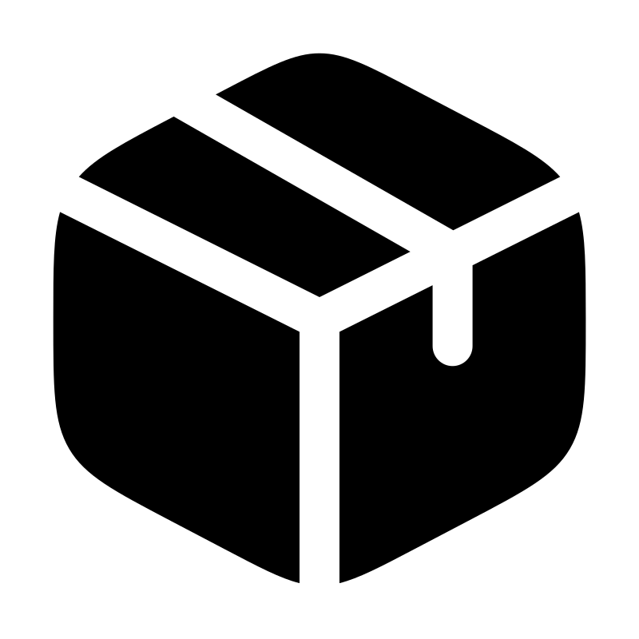

  
  <h1>DY Comps</h1>
  
<strong>Elegantly crafted React Components using Next.js, TypeScript, ShadCN, and Framer Motion.</strong>

## 🌟 About

DY Comps provides a collection of meticulously designed and highly customizable React components, built with modern technologies to ensure seamless performance and aesthetic appeal.

## 🚀 Features

- **Next.js & TypeScript**: Leverage the power of modern web development with scalability and type safety.
- **ShadCN Components**: Pre-styled, accessible, and easy-to-use UI components.
- **Framer Motion**: Smooth animations and transitions for an enhanced user experience.
- **Highly Customizable**: Tailor components to match your project's unique style and needs.
- **Optimized Performance**: Lightweight and efficient, ensuring a fast and smooth experience.
- **Developer-Friendly**: Well-structured code, easy-to-follow documentation, and seamless integration.

## 📜 Contribution

We welcome contributions! Check out our [Contributing Guide](CONTRIBUTING.md) for details on how to contribute.

## 📄 License

This project is licensed under the MIT License.

---

### 🌟 Stay Connected
- Follow updates on GitHub
- Join discussions and suggest features

Happy Coding! 🚀